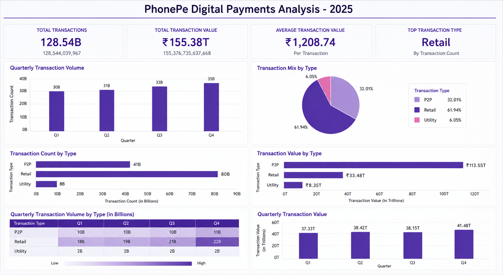

# PhonePe Digital Payments Analysis & Tableau Dashboard (2025)

An analysis of India's digital payments ecosystem using the PhonePe Pulse dataset — exploring transaction volume, value, and category-wise trends (P2P, Retail, Utility) through an interactive Tableau dashboard.

## 📌 Overview
This project analyzes PhonePe's transaction data to uncover patterns in digital payment usage across 2025 — including total transaction volume and value, quarterly growth trends, and a breakdown of transactions by type (Peer-to-Peer, Retail, and Utility payments).

## 🖼️ Dashboard Preview

## ✨ Features
- Key metrics overview: total transactions, total transaction value, and average transaction value
- Quarterly transaction volume and value trends (Q1–Q4)
- Transaction mix breakdown by type (P2P, Retail, Utility) with pie chart
- Transaction count and value comparison across categories
- Quarterly transaction volume by type in a detailed summary table
- Interactive Tableau dashboard with clean, color-coded visuals

## 🛠️ Tech Stack
- **Data Source:** PhonePe Pulse (public dataset)
- **Data Cleaning & Processing:** [Excel / Python (Pandas) / SQL — whichever you used]
- **Visualization:** Tableau

## 📊 Dashboard Highlights
- Total transactions in 2025 stood at **128.54 billion**, with a total transaction value of **₹155.38 trillion**
- **Retail** was the top transaction type by count, making up **61.94%** of all transactions, followed by P2P (32.01%) and Utility (6.05%)
- P2P transactions had the highest total value at **₹113.55 trillion**, despite Retail having a higher transaction count
- Transaction volume grew steadily each quarter — from **30B in Q1** to **35B in Q4**
- Average transaction value across the year was **₹1,208.74**

## 💡 What I Learned
Through this project, I learned how to clean and structure large-scale transactional data, calculate meaningful KPIs (like average transaction value and category-wise share), and present them through a clear, interactive dashboard for a non-technical audience.
